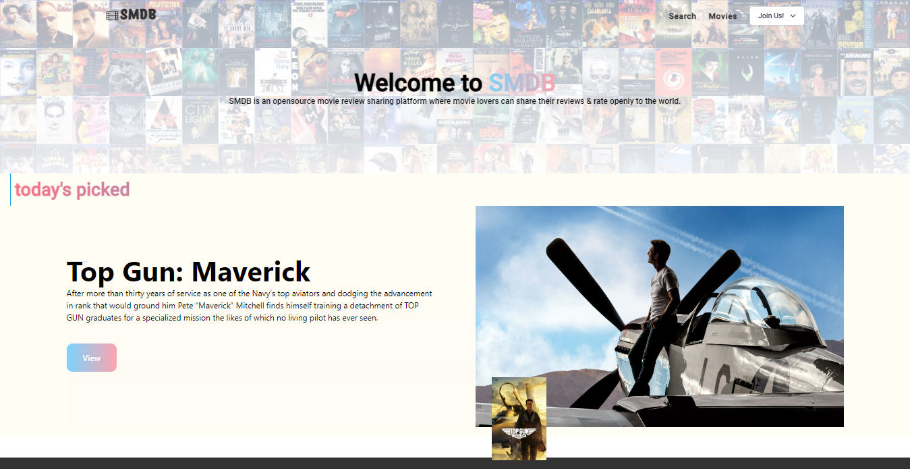

<h1 style="text-align: center">JAM stack Beginner project</h1>

     

     

**SMDB** is a JAM stack beginner project inspired for **IMDB** which is an online databse of information  to films, television series, home videos, video games, and streaming content online according to wikipedia.

### What i built `as a beginner` 
- ui
     - Fully Responsive beautiful layout and movie posters for different screen sizes.
     - Conditionally rendered components.
     - Intuitive navigation system.
     - Nav bar style change on scroll.

- auth
     - Users can register/log in to add reviews for the movies that come from **SMDB** database.
     - Users have their own profile page where all of their previous reviews are listed.

- CRUD functionality for user reviews 
     - A user can add multiple reviews and then edit or delete his/her own review when wanted.

- SSR
     - Data fetching (`fetch, custom hooks`)

### What i will keep developing

> - can add movies to the favourte list
> - can visit to other users' profile
> - can upload profile picture (using `cloudinary`)
> - upgrade security system

